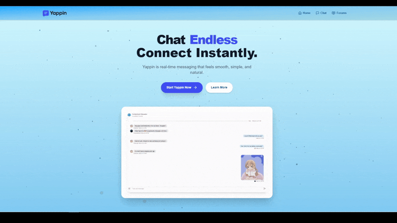

#  Yappin – Built for Talkers

## 🌟 Overview

Welcome to **Yappin** — your space to talk, share, and connect with others.
The **forums are live** and ready for you to start discussions, ask questions, or just hang out.
We’re also working on a **real-time chat feature**, so soon you’ll be able to chat instantly with your community.

The design is clean, responsive, and easy to use, so whether you’re on a phone or a laptop, Yappin feels smooth and simple. It’s all about making conversations feel natural and fun.

## ✨ Features

-  **Responsive UI** – Sleek, modern, and mobile-friendly
-  **Forums System** – Create, view, and reply to posts seamlessly
-  **Authentication** – Secure sign-up and login
-  **Real-time Chat** *(In Progress)* – Coming soon for instant communication
-  **Fast & Scalable** – Built with **Next.js**, **MongoDB**, and modern web technologies

## 🚀 Live Preview

**[🔗 Visit Yappin](https://yappin-gold.vercel.app/)**

## 🛠️ Tech Stack

- **Framework:** Next.js
- **Auth:** Clerk
- **Chat (Realtime):** Stream
- **Styling:** Tailwind CSS
- **Deployment:** Vercel

🔥 *Built with ❤️ by [Zulqarnain](https://github.com/ZulqarnainX)*
